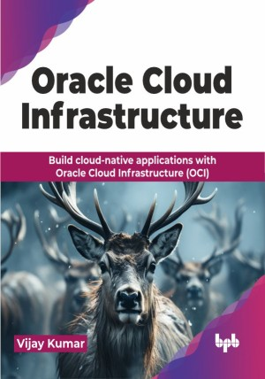

# Oracle Cloud Infrastructure

Build cloud-native applications with Oracle Cloud Infrastructure (OCI).

This is the repository for [Oracle Cloud Infrastructure
](https://bpbonline.com/products/oracle-cloud-infrastructure?variant=44023515676872),published by BPB Publications.

## About the Book
Public and enterprise clouds have forever changed the way enterprises build their applications. With access to seemingly unlimited resources, compute, and storage capacity businesses have started building and delivering application solutions at a never seen before pace. This book introduces the reader to OCI and many enterprise grade cloud-native services that OCI offers to businesses to help them build and enhance cloud-native applications to match the ever evolving customer requirements. 

The book begins with the basics of cloud computing and OCI, then moves to advanced topics like infrastructure as code, containers, Kubernetes, and serverless computing. Readers will learn to build and deploy scalable, resilient applications using OCI’s cloud-native services. The book also covers API management, event-driven architectures, and data solutions. With insights into no-code development and AI services, this guide helps developers leverage OCI to create innovative and efficient applications.

The book is written in a manner that readers at every stage of their cloud learning path can benefit from the material and implement the knowledge gained with real world applications.

## What You Will Learn
• Master OCI fundamentals, including IaaS, PaaS, and SaaS.

• Build cloud-native applications using Docker, Kubernetes, and serverless architecture.

• Effectively manage infrastructure with IaC, APIs, and event-driven patterns.

• Leverage AI, ML, and data solutions on OCI.

• Accelerate development with low-code/no-code tools and optimize application performance.
